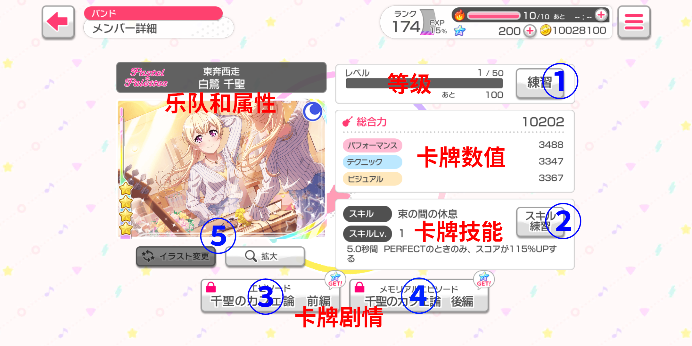

# 
Bandori 基础攻略

攻略正在编写中，欢迎补充和纠错
  
## 前言

这里教程的使用方法，不是把下面的内容一次性看完。而是当你在某方面遇到问题之后，再回到这里查看相关解决方案。

## 目录

 * [1. 游戏服务器选择、安装与运行](#1-游戏服务器选择安装与运行)
   * [1.1 游戏服务器选择](#11-游戏服务器选择)
   * [1.2 游戏安装](#12-游戏安装)
     * [1.2.1 安卓用户](#121-安卓用户)
     * [1.2.2 iOS用户](#122-ios用户)
   * [1.3 游戏运行](#13-游戏运行)
 * [2. 乐队（バンド）](#2-乐队バンド)
   * [2.1 卡牌介绍](#21-卡牌介绍)
   * [2.2 编成](#22-编成)
   * [2.3 所持道具](#23-所持道具)
     * [2.3.1 石头](#231-石头)
     * [2.3.2 音色石](#232-音色石)
     * [2.3.3 奇迹石](#233-奇迹石)
     * [2.3.4 红豆饼](#234-红豆饼)
     * [2.3.5 练习券与技能练习券](#235-练习券与技能练习券)
     * [2.3.6 大小火罐和等效火罐](#236-大小火罐和等效火罐)
   * [2.4 米歇尔贴纸交换所](#24-米歇尔贴纸交换所)
 * [3. 进行演奏（ライブ）](#3-进行演奏ライブ)
   * [3.1 Live前的准备](#31-Live前的准备)
     * [3.1.1 选歌与难度说明](#311-选歌与难度说明)
     * [3.1.2 Live界面UI](#312-live界面ui)
     * [3.1.3 延迟与速度](#313-延迟与速度)
   * [3.2 自由演奏（フリーライブ）](#32-自由演奏フリーライブ)
   * [3.3 协力演奏（協力ライブ）](#33-协力演奏協力ライブ)
 * [4. 活动（イベント）](#4-活动イベント)
   * [4.1 挑战LIVE（チャレンジライブ）](#41-挑战LIVEチャレンジライブ)
   * [4.2 共演LIVE（対パンライブ）](#42-共演LIVE対パンライブ)
   * [4.3 LIVE试炼（ライブトライ）](#43-LIVE试炼ライブトライ)
   * [4.4 任务LIVE（ミッションライブ）](#44-任务LIVEミッションライブ)
 * [5. 剧情故事（ストーリー）](#5-剧情故事ストーリー)
   * [5.1 主线剧情](#51-主线剧情)
   * [5.2 支线剧情](#52-支线剧情)
 * [6. 扭蛋（ガチャ）](#6-扭蛋ガチャ)
   * [6.1 卡池分类](#61-卡池分类)
   * [6.2 当期常规卡池](#62-当期常规卡池)
   * [6.2 FES卡池](#62-FES卡池)
   * [6.3 必得卡池](#63-必得卡池)
   * [6.4 超得卡池](#64-超得卡池)
   * [6.5 小型卡池](#65-小型卡池)
   * [6.6 天井](#66-天井)
   * [6.7 三星招募券卡池](#67-三星招募券卡池)
 * [7. 区域道具（エリアアイテム）](#7-区域道具エリアアイテム)
   * [7.1 指定乐队加成的道具](#71-指定乐队加成的道具)
   * [7.2 指定属性加成的道具](#72-指定属性加成的道具)
   * [7.3 指定某个数据加成的道具](#73-指定某个数据加成的道具)
 * [8. 账号功能和充值相关](#8-账号功能和充值相关)
   * [8.1 好友](#81-好友)
   * [8.2 账号转移](#82-账号转移)
     * [8.2.1 引继码](#821-引继码)
     * [8.2.2 绑定](#822-绑定)
   * [8.3 充值](#83-充值)
 * [9. F.A.Q.](#9-FAQ)
   * [通信错误/协力不能进/歌曲下载缓慢/协力绝赞读条等网络问题](#通信错误协力不能进歌曲下载缓慢协力绝赞读条等网络问题)
   * [我该怎么提升我的综合力](#我该怎么提升我的综合力)
   * [我缺少XXX材料](#我缺少XXX材料)
   * [怎么组成最佳队伍](#怎么组成最佳队伍)
   * [为什么我找不到XXX歌曲/XXX歌曲为什么我没有](#为什么我找不到XXX歌曲XXX歌曲为什么我没有)
   * [为什么我协力的队友分数比我高这么多](#为什么我协力的队友分数比我高这么多)
   * [为什么我抽不到我想要的卡](#为什么我抽不到我想要的卡)
 * [10. 常见误区](#10-常见误区)
  
## 1. 游戏服务器选择、安装与运行

### 1.1 游戏服务器选择

游戏目前有以下服务器：日服、国服、国际服、台服和韩服，在安装之前先需要确认自己想要玩哪个服。笔者未使用过国际服、台服和韩服，故不对这三个服列入表格。日服和国服之间的特性在表格中展示：

|特性|日服|国服|
|:---:|:---:|:---:|
|语言|日语|简体中文|
|登录方式|引继码|bilibili账号|
|部分歌曲可用性*|完整|版权受限|

\* 部分翻唱歌曲（例如：深爱、God knows...）因为版权原因，这些歌曲只在日服中会出现，在其他服中则不会出现。

注意，对于日服用户，一旦你在iOS上创建账号后，你可以通过[引继码](#821-引继码)将账号转移到安卓上，当然也可以将安卓上的转到iOS。但对于国服用户，同一个bilibili账号在iOS和安卓上的数据是**独立 不通用**的。即便如此，iOS的国服用户和安卓的国服用户依然可以完成[协力演奏](#33-协力演奏協力ライブ)。

对日服的大陆玩家而言，网络要求略为特殊，虽然大部分情况可以直连，但仍无法确保100%稳定，最好要有一个加速器或者稳定的梯子（梯子最好支持UDP转发）。

### 1.2 游戏安装

#### 1.2.1 安卓用户：

日服可以在[Google Play](https://play.google.com/store/apps/details?id=jp.co.craftegg.band)直接下载（你的Google Play必须为日区，才能下载日服）。如果你不可以使用Google Play，那么你可以去[QooApp](https://apps.qoo-app.com/app/4847)或者[TapTap](https://www.tap.io/app/38284)下载。

国服可以直接在B站客户端下载，或者去[B站下载页](https://www.biligame.com/detail/?id=168&sourceFrom=1112&action=1)登录后下载。亦可在[QooApp](https://apps.qoo-app.com/app/7982)或者[TapTap](https://www.tap.io/app/67848)下载。

#### 1.2.2 iOS用户：

下载日服需要使用日区AppStore账号，下载国服需要使用国区AppStore账号。

### 1.3 游戏运行

游戏运行并不需要谷歌套件，日服玩家可以直接玩，国服玩家则需要先登录bilibili账号。登录时遇到网络问题一直提示通信错误请参考[这里](#通信错误协力不能进歌曲下载缓慢协力绝赞读条等网络问题)。第一次进入游戏会提示下载数据包，根据自身情况选择精简版或者完整版数据包，笔者建议下载完整版数据包。下载完数据包后，经过一段剧情，需要输入玩家的昵称，玩家的昵称可以在日后**随时随地免费更改**。设置完昵称后，便进入新手教程。新手教程的测试曲为精简版的[ときめきエクスペリエンス!](https://zh.moegirl.org/%E5%BF%83%E8%B7%B3%E4%BD%93%E9%AA%8C(%E5%8D%95%E6%9B%B2)#)，且不扣体力。新手教程结束后玩家便可以自由操控游戏。

## 2. 乐队（バンド）

### 2.1 卡牌介绍

每张卡牌有很多个标识、属性

 * 星级：这个游戏中最高的星级是四星，最低是一星。二星及以上卡牌可以通过扭蛋获得，一星卡在阅读乐队剧情第一章时赠送
 
 * 等级：可以通过Live或者消耗练习券来提升等级。四星卡在特训之前的等级上限是50级，到达50级之后可以进行特训，特训之后等级上限变成60级。同理，三星卡则为40->50。
 
 * 乐队和属性：这和游戏里有5个乐队（这个不说明了）和4种类型（红色的パワフル，蓝色的クール，绿色的ピュア，橙色的ハッピー），每个乐队有5位角色，但每个角色的属性不是固定分配的。在活动期间，特定的角色和特定的属性编队有加成。某些区域道具会对指定乐队或指定属性的角色加成。
 
 * 卡牌数值：综合力 == パフォーマンス(Performance) + テクニック(Technical) + ビジュアル(Visual)。升级卡牌等级可以增加数值。某些区域道具会对这三个组成数值中间的某一个进行加成。テクニック
 
 * 卡牌技能：技能可大致分为以下几种：纯加分，加体力同时加分，判定强化同时加分，锁血同时加分，部分远古卡牌会有纯判定强化或者纯加体力。技能效果比较复杂，在这里不过多陈述。通过消耗技能练习券（区别于用于升级卡牌等级的练习券）可以提升技能等级，效果一般是提升持续时间，或者是回复体力的值。通过"吃"掉重复卡牌，也可以提升技能等级。
 
 * 卡牌剧情：分为一剧情（按钮③）和二剧情（按钮④）。一剧情的查看没有卡牌等级限制，二剧情的查看必须该卡牌特训后满级查看。查看剧情需要消耗石头，而且二剧情的消耗比一剧情的大。第一次查看一/二剧情可以获得25/50星石。查看剧情可以略微提升卡牌数值。
 
 * 特训：卡牌到达特训前满级时（三星：40，四星：50），可以通过消耗石头和奇迹石进行特训，特训后增加等级上限，并可以略微提升卡牌数值。一星二星卡牌无法特训。
 
 * ①按钮：通过消耗练习券提升等级。当等级到达特训前满级时，这个按钮变成特训，特训结束后，这个按钮变回练习，直到该卡牌特训后满级。
 
 * ②按钮：通过消耗技能练习券或者吃重复卡牌来提升技能等级。
 
 * ③④按钮：看卡牌剧情。
 
 * ⑤按钮：特训后左侧按钮可用，用于交换查看特训前后卡面。右侧按钮放大卡面至全屏。
 
### 2.2 编成

### 2.3 所持道具

所持道具分为石头、音色石、奇迹石、红豆饼和火罐。

#### 2.3.1 石头

石头按照属性来分，分别对应四种属性（橙蓝红绿）。按照大小来分，有大中小三种。石头在特训、阅读卡牌剧情、购买区域道具时会消耗。可以通过Live结算、活动奖励、米歇尔贴纸兑换等渠道获得石头。

#### 2.3.2 音色石

音色石只能用来在CiRCLE的乐曲商店购买翻唱曲目。可以通过活动奖励、米歇尔贴纸兑换等渠道获得音色石。注意，**Live不会掉落音色石**。

#### 2.3.3 奇迹石

奇迹石在特训、购买某些区域道具时会消耗。可以通过Live结算、活动奖励、米歇尔贴纸等渠道兑换。注意，在协力房中，**7w房反而比18w房掉落奇迹石数量更多**。

#### 2.3.4 红豆饼

红豆饼在购买某些区域道具时（制定属性加成的道具）会消耗。红豆饼**只能通过活动奖励获得**。

#### 2.3.5 练习券与技能练习券

练习券为白底黑字，写有STUDIO TICKET。作用是给卡牌升等级。可以通过非常多的渠道获得，但一般来说，主要的获取渠道仍然是Live结算。不需要担心这个东西见底或者库存紧张，因为练习券从中期开始就会非常非常多。

技能练习券为黄底粉字，写有SKILL TICKET。作用是给卡牌提升技能等级。主要获取渠道是活动奖励，后期可能会面临库存紧张，所以应当谨慎升级卡牌技能等级。笔者建议只对拥有纯加分技能的四星卡牌（即加分100%以上）升级技能。

#### 2.3.6 大小火罐和等效火罐

大火罐一次回复10火，小火罐一次回复1火。等效火罐是指特殊日子里，运营给你送的纪念性道具，使用效果和大火罐一样。但是一般大家都把它当作纪念品，而不去当作火罐使用。

### 2.4 米歇尔贴纸交换所

当你扭蛋抽出重复卡牌时，你可以将这些卡牌兑换成米歇尔贴纸（这些重复卡牌的另一种用途是给别的卡牌升技能等级，和技能练习券类似）。在日服更新[天井制度](#66-天井)之后，无法用于抽天井的当期道具，当期结束后会兑换成等量的米歇尔贴纸，请参考天井制度。

米歇尔贴纸可用于兑换很多种物品，包括卡牌（二星和三星）、练习劵和技能练习劵、三星以上招募劵、表情贴纸、音色石、奇迹石、红豆饼和各类石头。部分稀有道具（例如三星以上招募劵）每隔一段时间才能进行兑换。
 
## 3. 进行演奏（ライブ）

主界面右下角的**ライブ**可以开始进行演奏

### 3.1 Live前的准备

### 3.1.1 选歌与难度说明
### 3.1.2 Live界面UI
### 3.1.3 延迟与速度

### 3.2 自由演奏（フリーライブ）
### 3.3 协力演奏（協力ライブ）

## 4. 活动（イベント）
### 4.1 挑战LIVE（チャレンジライブ）
### 4.2 共演LIVE（対パンライブ）
### 4.3 LIVE试炼（ライブトライ）
### 4.4 任务LIVE（ミッションライブ）

## 5. 剧情故事（ストーリー）
### 5.1 主线剧情
### 5.2 支线剧情

## 6. 扭蛋（ガチャ）
### 6.1 卡池分类
### 6.2 当期常规卡池
### 6.2 FES卡池
### 6.3 必得卡池
### 6.4 超得卡池
### 6.5 小型卡池
### 6.6 天井
### 6.7 三星以上招募券卡池

## 7. 区域道具（エリアアイテム）
### 7.1 指定乐队加成的道具
### 7.2 指定属性加成的道具
### 7.3 指定某个数据加成的道具

## 8. 账号功能和充值相关
### 8.1 好友
### 8.2 账号转移
#### 8.2.1 引继码
#### 8.2.2 绑定
### 8.3 充值

## 9. F.A.Q.
### 通信错误/协力不能进/歌曲下载缓慢/协力绝赞读条等网络问题
### 我该怎么提升我的综合力
### 我缺少XXX材料
### 怎么组成最佳队伍
### 为什么我找不到XXX歌曲/XXX歌曲为什么我没有
### 为什么我协力的队友分数比我高这么多
### 为什么我抽不到我想要的卡

## 10. 常见误区
### 重复卡牌全部换成米歇尔贴纸，准备兑换三星以上兑换券
### 凑够2500星石赶紧抽一发十连
